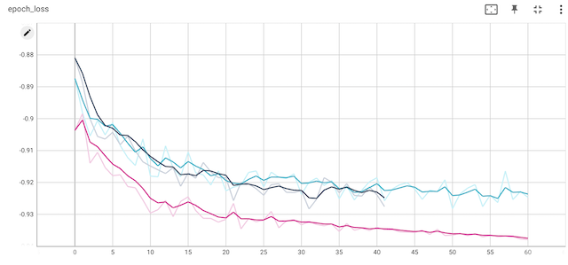

# tensorflow-examples
Examples using TensorFlow, Keras

## [Vector-prediction model for race orderings](Models/vector_predict.py)

A client asked me to create a model predicting the outcome of a race. Their original model, which was based on the idea of predicting individual competitors (outcome was binary 1/0 for whether a competitor won the race/ was in the top-3) did not work very well. So I modified the approach to instead predict the vector of orderings of competitors in the race. My intuition was that this better captures the task at hand: not to predict the result of a competitor in the abstract, but of a competitor in relation to other competitors. The model also worked much better, in terms of the metric the client was using.

Since we don't care about the magnitude of the outcomes, but just their relative magnitudes, we're interested in the 'angle' of the vector we're predicting, so I used CosineSimilarity as a loss function.

Perhaps I'm just bad at googling but I didn't see other examples like this so I thought I would share it.

The code also contains a custom DataGenerator that organizes the races into batches with padding + masking.

